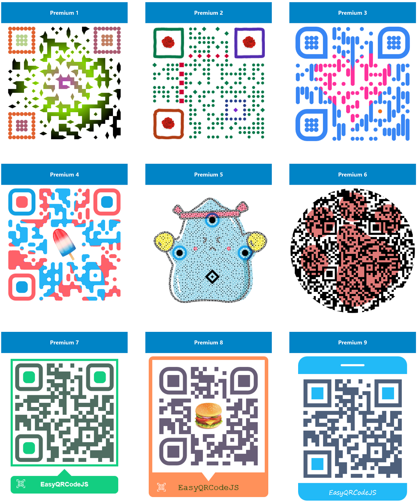

# EasyQRCode React Native

A QRCode component for React Native. Support Dot style, Logo, Background image, Colorful, Title etc. settings. Support Angular, Vue.js, React, Next.js framework. Support binary(hex) data mode.


## Table of contents

- [Choose what you need](#choose-what-you-need)
- [Feature](#feature)
- [Try It!](#try-it)
- [Demo preview](#demo-preview)
- [QR Code Structure](#qr-code-structure)
- [Installation](#installation)
- [Basic Usages](#basic-usages)
- [QRCode API](#qrcode-api)
  - [Object](#object)
  - [Options](#options)
  - [Method](#method)
- [How to load Images?](#how-to-load-images)
- [Get Base64 data of QRCode](#get-base64-data-of-qrcode)
- [License](#license)
- [EasyQRCode-React-Native-Premium](#react-native-easyqrcode-premium)
- [End](#end)


## Choose what you need

| Project | Support |
| --- | --- |
| [EasyQRCodeJS](https://github.com/ushelp/EasyQRCodeJS) | **Running with DOM on CLIENT-SIDE .** Browser(IE6+, Chrome, Firefox, Safari, Opera, Mobile Safari, Android, Windows Mobile, ETC.), Electron, NW.js, ETC.  |
| [EasyQRCodeJS-NodeJS](https://github.com/ushelp/EasyQRCodeJS-NodeJS) | **Running without DOM on SERVER-SIDE**. Save image to file(PNG/JPEG/SVG) or get data url text.  NodeJS, Electron, NW.js, ETC.|
| [EasyQRCode-React-Native](https://github.com/ushelp/EasyQRCode-React-Native) | **A QRCode generator for React Native**. Generate QRCode image or get base64 data url text. |


## Feature

- **English**

    - Required Patterns that support dot style

	- Support unicode character set:  `😊❤️👍👨‍💻 Hello, こんにちは, こんにちは, Γεια, Привет, नमस्ते, สวัสดี, Привіт, سلام, Здравей, ສະບາຍດີ, Përshëndetje, Բարեւ, 你好`
 
    - Support for Quiet Zone settings
	
    - Support custom Position Pattern inner fill and outer border color

    - Support custom Alignment Pattern inner fill and outer border color

    - Support custom Timing Patterns vertical, horizontal color

    - Support Logo images (including transparent PNG images)

    - Support Background Image

    - Support for title, subtitle settings

    - Support binary(hex) data mode
    
    - Support TypeScript
    
- **中文**

    - 支持点形风格的 Required Patterns

	- 支持 Unicode 字符集:  `😊❤️👍👨‍💻 Hello, こんにちは, こんにちは, Γεια, Привет, नमस्ते, สวัสดี, Привіт, سلام, Здравей, ສະບາຍດີ, Përshëndetje, Բարեւ, 你好`

    - 支持 Quiet Zone 设置
	
    - 支持自定义 Position Pattern 内填充和外边框颜色
	
    - 支持自定义 Alignment Pattern 内填充和外边框颜色

    - 支持自定义 Timing Patterns 垂直，水平颜色

    - 支持 Logo 图片（包括背景透明的 PNG 图片）

    - 支持 Background Image 背景图片

    - 支持标题，副标题设置
	
    - 二进制数据模式支持

    - TypeScript 支持

## Try It!

[Try It!](http://www.easyproject.cn/easyqrcodejs/tryit.html "EasyQRCodeJS Try It!")

## Demo preview


## QR Code Structure


## Installation

```BASH
npm install react-native-webview
react-native link react-native-webview

npm install easyqrcode-react-native
```

## Basic Usages
```JS
import React, { Component } from 'react';
import {
  View
} from 'react-native';

// 1. Import 
import {QRCode, Canvas} from 'easyqrcode-react-native';

class App extends  Component{
    
    // 3. Generate QRCode
    generateQRCode = (canvas) => {
        if (canvas !== null){
            // QRCode options
            var options = {
                text: "www.easyproject.cn/donation",
        	};
        	// Create QRCode Object
        	var qrCode = new QRCode(canvas, options);
        }
      }
    
   render() { 
      return (
          <View>
            {/* 2. QRCode Canvas  */}
            <Canvas ref={this.generateQRCode}/>
          </View>
      );
  }
};

export default App;
```

## QRCode API

### Object

```JS
var qrcode = new QRCode(canvas_object, options_object);
```


### Options

```JS
 var options_object = {
    // ====== Basic
    text: "https://github.com/ushelp/EasyQRCodeJS",
    width: 256,
    height: 256,
    colorDark : "#000000",
    colorLight : "#ffffff",
    correctLevel : QRCode.CorrectLevel.H, // L, M, Q, H
    
    // ====== dotScale
    /*
    dotScale: 1, // For body block, must be greater than 0, less than or equal to 1. default is 1
    
    dotScaleTiming: 1, // Dafault for timing block , must be greater than 0, less than or equal to 1. default is 1
    dotScaleTiming_H: undefined, // For horizontal timing block, must be greater than 0, less than or equal to 1. default is 1
    dotScaleTiming_V: undefined, // For vertical timing block, must be greater than 0, less than or equal to 1. default is 1
    
    dotScaleA: 1, // Dafault for alignment block, must be greater than 0, less than or equal to 1. default is 1
    dotScaleAO: undefined, // For alignment outer block, must be greater than 0, less than or equal to 1. default is 1
    dotScaleAI: undefined, // For alignment inner block, must be greater than 0, less than or equal to 1. default is 1
    */
   
    // ====== Quiet Zone
    /*
    quietZone: 0,
    quietZoneColor: "rgba(0,0,0,0)",
    */

    // ====== Logo
    /*
    logo: "https://avatars1.githubusercontent.com/u/4082017?s=160&v=4",  //  support: Static Image Resources, Network Images, Base64 Uri Data Images
    logoWidth: 80, // fixed logo width. default is `width/3.5`
    logoHeight: 80, // fixed logo height. default is `heigth/3.5`
    logoMaxWidth: undefined, // Maximum logo width. if set will ignore `logoWidth` value
    logoMaxHeight: undefined, // Maximum logo height. if set will ignore `logoHeight` value
    logoBackgroundColor: '#fffff', // Logo backgroud color, Invalid when `logBgTransparent` is true; default is '#ffffff'
    logoBackgroundTransparent: false, // Whether use transparent image, default is false
    */

    // ====== Backgroud Image
    /*
    backgroundImage: '', // support: Static Image Resources, Network Images, Base64 Uri Data Images
    backgroundImageAlpha: 1, // Background image transparency, value between 0 and 1. default is 1. 
    autoColor: false, // Automatic color adjustment(for data block)
    autoColorDark: "rgba(0, 0, 0, .6)", // Automatic color: dark CSS color
    autoColorLight: "rgba(255, 255, 255, .7)", // Automatic color: light CSS color
    */
    
    // ====== Colorful
    // === Posotion Pattern(Eye) Color
    /*
    PO: '#e1622f', // Global Posotion Outer color. if not set, the defaut is `colorDark`
    PI: '#aa5b71', // Global Posotion Inner color. if not set, the defaut is `colorDark`
    PO_TL:'', // Posotion Outer color - Top Left 
    PI_TL:'', // Posotion Inner color - Top Left 
    PO_TR:'', // Posotion Outer color - Top Right 
    PI_TR:'', // Posotion Inner color - Top Right 
    PO_BL:'', // Posotion Outer color - Bottom Left 
    PI_BL:'', // Posotion Inner color - Bottom Left 
    */
    // === Alignment Color
    /*
    AO: '', // Alignment Outer. if not set, the defaut is `colorDark`
    AI: '', // Alignment Inner. if not set, the defaut is `colorDark`
    */
    // === Timing Pattern Color
    /*
    timing: '#e1622f', // Global Timing color. if not set, the defaut is `colorDark`
    timing_H: '', // Horizontal timing color
    timing_V: '', // Vertical timing color
    */
    
    // ====== Title
    /*
    title: 'QR Title', // content 
    titleFont: "normal normal bold 18px Arial", //font. default is "bold 16px Arial"
    titleColor: "#004284", // color. default is "#000"
    titleBackgroundColor: "#fff", // background color. default is "#fff"
    titleHeight: 70, // height, including subTitle. default is 0
    titleTop: 25, // draws y coordinates. default is 30
    */
   
    // ====== SubTitle
    /*
    subTitle: 'QR subTitle', // content
    subTitleFont: "normal normal normal 14px Arial", // font. default is "14px Arial"
    subTitleColor: "#004284", // color. default is "4F4F4F"
    subTitleTop: 40, // draws y coordinates. default is 0
    */
   
    // ===== Event Handler
    /*
    onRenderingStart: undefined,
    onRenderingEnd: undefined,
    */
   
    // ===== Versions
    /*
    version: 0, // The symbol versions of QR Code range from Version 1 to Version 40. default 0 means automatically choose the closest version based on the text length.
    */     
   
    // ===== Binary(hex) data mode
    /*
    binary: false, // Whether it is binary mode, default is text mode. 
    */ 
   
    // =====  UTF-8 without BOM
    /*
    utf8WithoutBOM: true
    */      
}
```

| Option | Required | Type | Defaults | Description |
| --- | --- |--- | --- |--- | 
| Basic options| --- | ---|---|---|
| **text** | Y | String |`''` |  Text |
| **width** | N | Number | `256` |  Width | 
| **height** | N | Number | `256` |  Height | 
| **colorDark** | N | String | `#000000` | Dark CSS color, `rgba(0,0,0,0)`|
| **colorLight** | N | String | `#ffffff` | Light CSS color, `rgba(0,0,0,0)` |  
| **correctLevel** | N | Enum | `QRCode.CorrectLevel.H` | `QRCode.CorrectLevel.H`<br/>`QRCode.CorrectLevel.Q` <br/> `QRCode.CorrectLevel.M` <br/> `QRCode.CorrectLevel.L`|  
| **dotScale** | N | Number | `1.0` |Dot style required Patterns. Ranges: `0-1.0` |
| Dot style| --- | ---|---|---|
| **dotScale** | N | Number | `1.0` |Dot style scale. Ranges: `0-1.0` |
| **dotScaleTiming** | N | Number | `1.0` |Dot style scale for timing. Ranges: `0-1.0` |
| **dotScaleTiming_V** | N | Number | `undefined` |Dot style scale for horizontal timing. Ranges: `0-1.0` |
| **dotScaleTiming_H** | N | Number | `undefined` |Dot style scale for vertical timing. Ranges: `0-1.0` |
| **dotScaleA** | N | Number | `1.0` |Dot style scale for alignment. Ranges: `0-1.0` | 
| **dotScaleAO** | N | Number | `undefined` |Dot style scale for alignment outer. Ranges: `0-1.0` |
| **dotScaleAI** | N | Number | `undefined` |Dot style scale for alignment inner. Ranges: `0-1.0` |
| Quiet Zone| --- | ---|---|---|
| **quietZone** | N | Number | `0` |  Quiet Zone size | 
| **quietZoneColor** | N | String | `rgba(0,0,0,0)` |  Background CSS color to Quiet Zone |
| Logo options| --- | ---|---|---|
| **logo** | N | String | `undefined` |  support: Static Image Resources, Network Images(`http://`, `https://`, `ftp://`), Base64 Uri Data Images |  
| **logoWidth** | N | Number | `width/3.5` |  Fixed logo width. |  
| **logoHeight** | N | Number | `height/3.5` |  fixed logo height. | 
| **logoMaxWidth** | N | Number | `undefined` |  Maximum logo width. if set will ignore `logoWidth` value. | 
| **logoMaxHeight** | N | Number | `undefined` |  Maximum logo height. if set will ignore `logoHeight` value. |  
| **logoBackgroundTransparent** | N | Boolean | `false` |  Whether the background transparent image(`PNG`) shows transparency. When `true`, `logoBackgroundColor` is invalid |  
| **logoBackgroundColor** | N | String | `#ffffff` |  Set Background CSS Color when image background transparent. Valid when `logoBackgroundTransparent` is `false` | 
| Backgroud Image options|  ---|--- |---|---|
| **backgroundImage** | N | String | `undefined` | Background Image Path or Base64 encoded Image. If use relative address, relative to `easy.qrcode.min.js` |  
| **backgroundImageAlpha** | N | Number | `1.0` |  Background image transparency. Ranges: `0-1.0`  | 
| **autoColor** | N | Boolean | `false` |  Automatic color adjustment(for data block) | 
| **autoColorDark** | N | String | `rgba(0, 0, 0, .6)` |  Automatic color: dark CSS color  |
| **autoColorLight** | N | String | `rgba(255, 255, 255, .7)` |  Automatic color: light CSS color |
| Posotion Pattern Color options| --- | ---|---|---|
| **PO** | N | String | `undefined` | Global Posotion Outer CSS color. if not set, the defaut is `colorDark` | 
| **PI** | N | String | `undefined` | Global Posotion Inner CSS color. if not set, the defaut is `colorDark` |  
| **PO_TL** | N | String | `undefined` | Posotion Outer CSS color - Top Left | 
| **PI_TL** | N | String | `undefined` | Posotion Inner CSS color - Top Left | 
| **PO_TR** | N | String | `undefined` | Posotion Outer CSS color - Top Right | 
| **PI_TR** | N | String | `undefined` | Posotion Inner CSS color - Top Right |  
| **PO_BL** | N | String | `undefined` | Posotion Outer CSS color - Bottom Left |  
| **PI_BL** | N | String | `undefined` | Posotion Inner CSS color - Bottom Left |  
| Alignment Color options| --- |--- |---|---|
| **AO** | N | String | `undefined` | Alignment Outer CSS color. if not set, the defaut is `colorDark` | 
| **AI** | N | String | `undefined` | Alignment Inner CSS color. if not set, the defaut is `colorDark` | 
| Timing Pattern Color options| --- | ---|---|---|
| **timing** | N | String | `undefined` | Global Timing CSS color. if not set, the defaut is `colorDark` | 
| **timing_H** | N | String | `undefined` | Horizontal timing CSS color |  
| **timing_V** | N | String | `undefined` | Vertical timing CSS color |  
| Title options| --- | ---|---|---|
| **title** | N | String | `''` |  | 
| **titleFont** | N | String | `normal normal bold 16px Arial` | CSS Font |  
| **titleColor** | N | String | `#000000` | CSS color | 
| **titleBackgroundColor** | N | String | `#ffffff` | CSS color| 
| **titleHeight** | N | Number | `0` | Title Height, Include subTitle | 
| **titleTop** | N | Number | `30` | draws y coordinates.|  
| SubTitle options| --- | ---|---|---|
| **subTitle** | N | String | `''` |  |  
| **subTitleFont** | N | String | `normal normal normal 14px Arial` | CSS Font |  
| **subTitleColor** | N | String | `#4F4F4F` | CSS color |  
| **subTitleTop** | N | Number | `0` | draws y coordinates. default is 0|  
| Event Handler options| --- | ---|---|---|
| **onRenderingStart(qrCodeOptions)** | N | Function | `undefined` | Callback function when the rendering start. can use to hide loading state or handling.  |  
| **onRenderingEnd(qrCodeOptions, base64DataFn)** | N | Function | `undefined` | Callback function when the rendering ends. `base64DataFn` parameter is the base64 data execution function of QRCode, returns a Promise that resolves to DataURL.   | 
| Version options| --- | ---|---|---|
| **version** | N | Number | `0` | The symbol versions of QR Code range from Version `1` to Version `40`. default 0 means automatically choose the closest version based on the text length. [Information capacity and versions of QR Codes](https://www.qrcode.com/en/about/version.html)  **NOTE**: If you set a value less than the minimum version available for text, the minimum version is automatically used. | 
| Tooltip options| --- | ---|---|---|
| **tooltip** | N | Boolean | `false` | Whether set the QRCode Text as the title attribute value of the QRCode div. | 
| UTF-8 options| --- | ---|---|---|
| **utf8WithoutBOM** | N | Boolean | `true` | Use UTF-8 without BOM. set to `false` value will use BOM in UFT-8.|
| Binary(hex) data model options| --- | ---|---|---|
| **binary** | N | Boolean | `false` | Whether it is binary mode, default is text mode.  | 


### Method

- makeCode(text)

	```JS
	qrcode.makeCode("https://github.com/ushelp/EasyQRCodeJS"); // make another code text.
	```

    
## How to load Images?

You can use **Static Image Resources**, **Network Images**, **Base64 Data Uri Resources** to load images.

```JS
// Static Image Resources
const logoImage = Image.resolveAssetSource(require('./logo.png')).uri;

// Network Images
const logoImage = "https://avatars1.githubusercontent.com/u/4082017?s=160&v=4";

// Base64 Data Uri Resources
const logoImage = "data:image/png;base64,iVBORw0KGgoAAAAN...";

var options = {
    // ...
    logo: logoImage

    // ...
}
```


## Get Base64 data of QRCode

Use **onRenderingEnd(qrCodeOptions, base64DataFn)** to get Base64 data url of the QRCode. `base64DataFn` parameter is the base64 data execution function of QRCode, returns a Promise that resolves to DataURL. 

```JS
var options = {
    
    // ...
    
    onRenderingEnd: function(qrCodeOptions, base64DataFn){
        
        base64DataFn().then(base64DataURL=>{
            console.log(base64DataURL);
        })
        
    }
    
    // ...
} 
```

If you encounter `Tainted canvases may not be exported` error. Please convert your images(`logo`, `background`, `...`) to Base64 Data URL.

```
Error: Failed to execute 'toDataURL' on 'HTMLCanvasElement': Tainted canvases may not be exported.
```

## License
MIT License


## EasyQRCode-React-Native-Premium
## 
*Let you draw freely!*

**EasyQRCodeJS-Premium** is a more powerful and comprehensive enterprise version. You can use Canvas to customize any element, such as eye frame shape, eyeball shape, QR code block shape, and more. Also supports excavation (to prevent the QRcode overlap with the logo), random block mode.

If you need more functions, we can provide you with customized development of API libraries or products. please contact me to buy the business enterprise edition.

**EasyQRCodeJS-Premium** 是功能更加强大和全面的商业/企业版本。让您可以在 QRCode 中通过 Canvas 自定义任何喜欢的元素，例如  Eye frame 形状, Eye ball 形状, QR Body block 形状等等。 还支持 Logo 挖取（excavation，防止二维码与 Logo 重叠）和 Random bolock mode.

如果您需要更多功能，我们可以为您提供 API 库或产品的定制开发。请联系我购买商业/企业版本。




## End

Email：<inthinkcolor@gmail.com>

[http://www.easyproject.cn](http://www.easyproject.cn "EasyProject Home")


**Donation/捐助:**

<a href="http://www.easyproject.cn/donation">
</img></a>
<div>支付宝/微信/QQ/云闪付/PayPal</div>

<br/>

我们相信，每个人的点滴贡献，都将是推动产生更多、更好免费开源产品的一大步。

**感谢慷慨捐助，以支持服务器运行和鼓励更多社区成员。**

We believe that the contribution of each bit by bit, will be driven to produce more and better free and open source products a big step.

**Thank you donation to support the server running and encourage more community members.**


